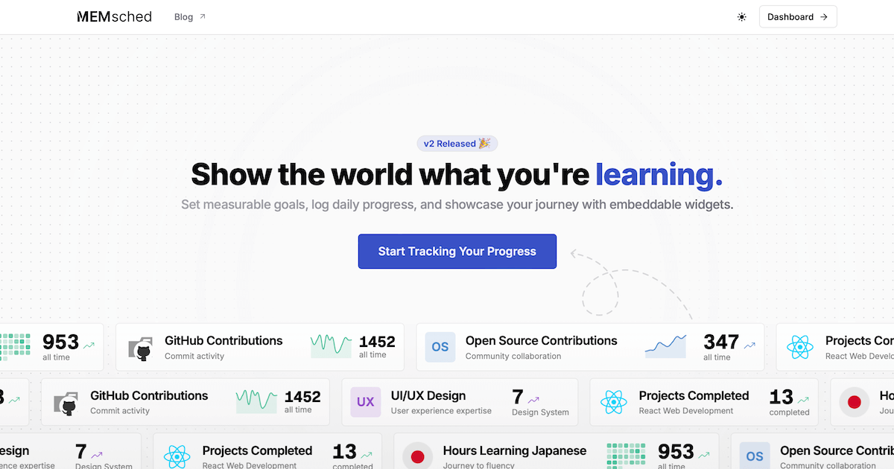

# MEMsched

MEMsched helps you showcase your learning journey to the world.

**Key Features:**

- **Set Measurable Goals:** Define clear learning objectives with specific metrics to track skill development.
- **Log Daily Progress:** Regularly update your learning metrics to visualize growth and track achievements over time.
- **Embeddable Widgets:** Generate customizable, auto-updating widgets to showcase your progress on your website, GitHub profile, or portfolio.

Start tracking your progress and share your achievements!
